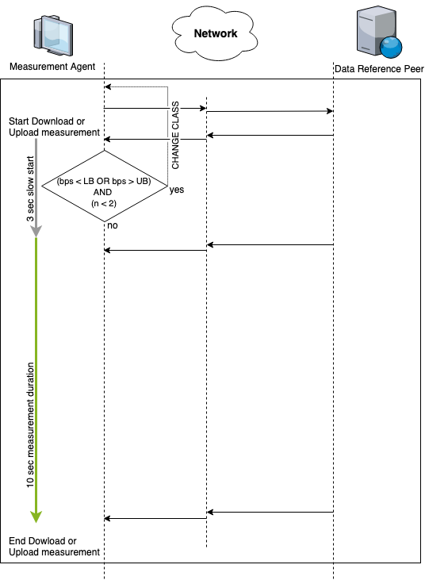
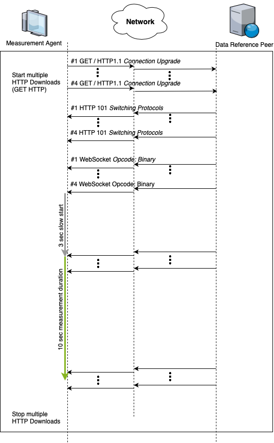
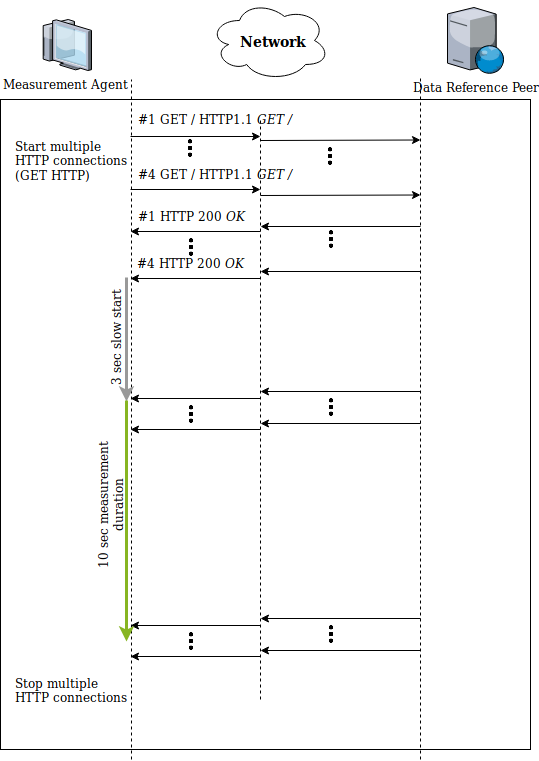
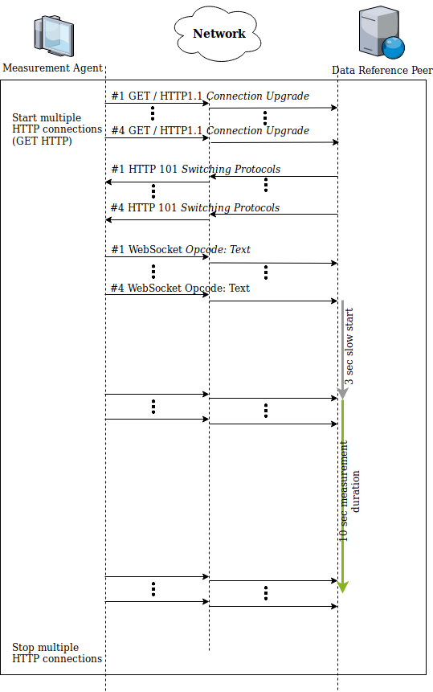
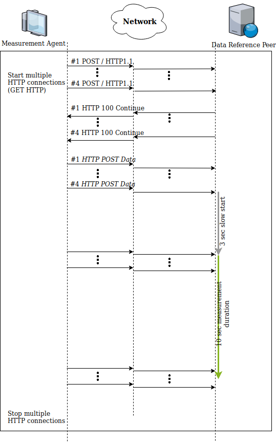
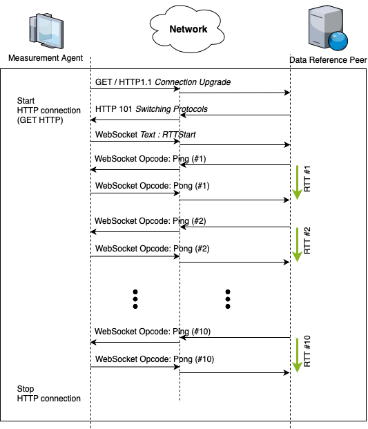
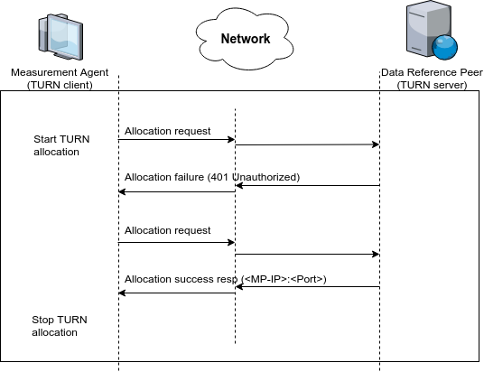

= Technical Specification - BEREC NNTool.eu
:toc: left
:toc-title: Table of Content
.Ratpack

== General
BEREC – the Body of European Regulators for Electronic Communications – assigned the contract for development, implementation and validation of the Net Neutrality (NN) Reference Measurement System in July 2018.

The system enables the monitoring of the Quality of Service (QoS) and Quality of Experience (QoE) of Internet Access Services (IAS) as well as aspects of traffic management and serves as a reference for regulatory authorities (NRAs). This decision is another important milestone in the harmonization and standardization of broadband testing in Europe.

The objective of the measurement tool is to provide a reference system for monitoring the QoS aspects of IAS, such as speed and delay, as well as aspects of traffic management such as the blocking and throttling of Internet-based applications.

A specific objective is increased levels of harmonization of NN-related IAS measurement metrics and methodology.

In the long term, the BEREC tool could be a platform enabling NRAs to share knowledge, experience and expertise, including providing a basis for further piloting and researching the area of measuring quality of internet access services.

Visit https://net-neutrality.tools/ for more information.

== Assessment Methodology

=== Measuring Internet access service quality

==== IAS download speed measurements
In the module of IAS download speed measurement, the specifications of the BEREC Net Neutrality Regulatory Assessment Methodology (BoR (17) 178) are implemented as part of the reference measurement system. The following description defines the software methods and settings according to the given methodology.

The frequently used Hypertext Transfer Protocol (HTTP) is used on top of Transmission Control Protocol (TCP) to represent a realistic user situation.
In order to establish an end-to-end data connection between Measurement Agent and Data Reference Peer, the load generating application data is transferred via WebSocket connections in the case of Browser and Apple iOS App measurements. In the case of Android App measurements, the load generating application data is transferred via HTTP connections.

To minimize the influence of the congestion control characteristics of TCP and to reduce limitations by the bandwidth-delay product of a single TCP stream, several parallel HTTP / WebSocket data streams are initiated, which transmit sufficient test data from the data reference peer to the measurement agent. For this purpose, a random and large enough amount of data is continuously provided on the data reference peer during the measurement.
Furthermore, a 3 second slow start phase is performed at the beginning of the measurement, starting after the connection setup of the streams. Starting at this time, test data is transmitted over all streams until the end of the measurement. The transition between the slow start phase and the measurement phase is seamless. An additional data request from client to server within the streams is not required (compare to BoR (17) 178 Chap 3.1.1).
The data transmission of all data streams is terminated after a specified time of 10 seconds, subsequent to the 3 second slow start phase.

RFC 6455 specifies that application data is transmitted as sequences of frames (data frames) within WebSocket connections. Different data sizes of WebSocket frame are used, depending on connection speed under test, to ensure adequate performance on client side when using different software components (Chrome, Firefox, etc.).
To ensure compatibility, data is transmitted in opcode “Binary Frame” (WebSocket Frame type) format.

Depending on connection speed under test, the following measurement parameters are used for browser and iOS download measurements:
[cols=3*,options=header]
|===
|Speed class
|Streams
|Frame-size
|low
|4
|2048
|default
|4
|32768
|high
|4
|524288
|very high
|8
|524288
|===

The speed classes mentioned above are defined below.
[cols=2*,options=header]
|===
|Speed class
|Speed
|low
|< 1.05 Mbit/s
|default
|0.95 - 525 Mbit/s
|high
|475 - 1050 Mbit/s
|very high
|950 - 9000 Mbit/s
|===

For Chromium-based Browsers, the default and high speed classes differ to reduce client load (see *Calculating speed based on TCP payload*):
[cols=2*,options=header]
|===
|Speed class
|Speed
|default
|0.95 - 340 Mbit/s
|high
|310 - 1050 Mbit/s
|===

For the selection of the optimal measurement parameters, the default setting is used at measurement start. The automatic selection of the speed class is performed with an analysis of the first valid data transmission rate within the slow start phase. If the measured throughput rate at this point is not within the boundaries of the currently selected speed class (bps < LB OR bps > UB), the settings are adjusted to the next higher, respective lower, speed class. The connections are terminated and the slow start phase is executed again, repeating the aforementioned steps with the new measurement parameters. If the first valid data transmission rate within the slow start phase is within the boundaries of the currently selected speed class (bps > LB AND bps < UB), the measurement continues until the defined end. A speed class change can be performed at most n=2 times: the third tested speed class will be continued until the defined end, regardless of the configured Lower and Upper boundaries. Additionally, a re-use of a previously tested speed class within one measurement is not possible to prevent speed class bouncing. In case of Android, no speed classes are necessary, as native stream-based TCP sockets are used.

The download time is the time from the start of the last connection to the termination of the first connection following the defined download duration while taking effects of TCP Congestion Control (slow start phase) into account.

The use of Transport Layer Security (TLS) in form of HTTPS or WebSocket Secure (WebSocket over HTTPS) is optional possible. TLS effectively prevents middleboxes like HTTP proxies from interfering during measurement setup (HTTP / WebSocket Header manipulation, etc.) and during the actual measurement (Caching, etc.). Please note that the usage of TLS introduces overhead to the measurement which can not be determined on application level. 

==== IAS upload speed measurements
In the module of IAS upload speed measurement, the specifications of the BEREC Net Neutrality Regulatory Assessment Methodology (BoR (17) 178) are implemented as part of the reference measurement system. The following description defines the software methods and settings according to the given methodology.

The frequently used Hypertext Transfer Protocol (HTTP) is used on top of Transmission Control Protocol (TCP) to represent a realistic user situation.
In order to establish an end-to-end data connection between Measurement Agent and Data Reference Peer, the load generating application data is transferred via WebSocket connections in the case of Browser and Apple iOS App measurements. In the case of Android App measurements, the load generating application data is transferred via HTTP connections.

To minimize the influence of the congestion control characteristics of TCP and to reduce limitations by the bandwidth-delay product of a single TCP stream, several parallel HTTP / WebSocket data streams are initiated, which transmit sufficient test data from the measurement agent to the data reference peer. For this purpose, a random and large enough amount of data is continuously provided on the measurement agent during the measurement.
Furthermore, a 3 second slow start phase is performed at the beginning of the measurement, starting after the connection setup of the streams. Starting at this time, test data is transmitted over all streams until the end of the measurement. The transition between the slow start phase and the measurement phase is seamless. An additional data request from client to server within the streams is not required (compare to BoR (17) 178 Chap 3.1.1).
The data transmission of all data streams is terminated after a specified time of 10 seconds, subsequent to the 3 second slow start phase.

RFC 6455 specifies that application data is transmitted as sequences of frames (data frames) within WebSocket connections. Different data sizes of WebSocket frame are used, depending on connection speed under test, to ensure adequate performance on client side when using different software components (Chrome, Firefox, etc.).
To ensure compatibility, data is transmitted in opcode “Text Frame” (WebSocket Frame type) format.

Depending on connection speed under test, the following measurement parameters are used for browser upload measurements:
[cols=3*,options=header]
|===
|Speed class
|Streams
|Frame-size
|low
|4
|2048
|default
|4
|65535
|high
|4
|65535
|very high
|8
|65535
|===

Depending on connection speed under test, the following measurement parameters are used for iOS upload measurements:
[cols=3*,options=header]
|===
|Speed class
|Streams
|Frame-size
|low
|4
|2048
|default
|4
|65535
|high
|4
|65535
|very high
|20
|65535
|===

The speed classes mentioned above are defined below.
[cols=2*,options=header]
|===
|Speed class
|Speed
|low
|< 1.05 Mbit/s
|default
|0.95 - 525 Mbit/s
|high
|475 - 1050 Mbit/s
|very high
|950 - 9000 Mbit/s
|===

For Chromium-based Browsers, the default and high speed classes differ to reduce client load:
[cols=2*,options=header]
|===
|Speed class
|Speed
|default
|0.95 - 210 Mbit/s
|high
|190 - 1050 Mbit/s
|===

For the selection of the optimal measurement parameters, the default setting is used at measurement start. The automatic selection of the speed class is performed with an analysis of the first valid data transmission rate within the slow start phase. If the measured throughput rate at this point is not within the boundaries of the currently selected speed class (bps < LB OR bps > UB), the settings are adjusted to the next higher, respective lower, speed class. The connections are terminated and the slow start phase is executed again, repeating the aforementioned steps with the new measurement parameters. If the first valid data transmission rate within the slow start phase is within the boundaries of the currently selected speed class (bps > LB AND bps < UB), the measurement continues until the defined end. A speed class change can be performed at most n=2 times: the third tested speed class will be continued until the defined end, regardless of the configured Lower and Upper boundaries. Additionally, a re-use of a previously tested speed class within one measurement is not possible to prevent speed class bouncing. In case of Android, no speed classes are necessary, as native stream-based TCP sockets are used.

The upload time is the time from the start of the last connection to the termination of the first connection following the defined upload duration minus 2 seconds while taking effects of TCP Congestion Control (slow start phase) into account. The additional 2 seconds are required to await in-transit upload reports generated by the measurement peer to be received by the measurement agent.

The use of Transport Layer Security (TLS) in form of HTTPS or WebSocket Secure (WebSocket over HTTPS) is optional possible. TLS effectively prevents middleboxes like HTTP proxies from interfering during measurement setup (HTTP / WebSocket Header manipulation, etc.) and during the actual measurement (Caching, etc.). Please note that the usage of TLS introduces overhead to the measurement which can not be determined on application level.

==== Calculating speed based on TCP payload
The data transmission rates are evaluated on receiver side, i.e., on measurement agent in the case of download measurements and on data reference peer in the case of upload measurements. For calculation, the received HTTP Payload, repective WebSocket Payload plus WebSocket Header, of all parallel streams during download/upload time is divided by the download/upload time. This considered Payload is equal to the TCP payload at application level.

In the case of WebSocket download, only completely received WebSocket frames are considered, since only these can be evaluated at application level. For WebSocket download and upload, the WebSocket header is included with a dynamic calculation of the header size according to RFC 6455.
The WebSocket frame size should therefore be chosen in a well-balanced way in order to avoid an inaccurate throughput determination on one hand, and to guarantee a sufficiently good performance on the agent side (each computation of a received WebSocket Frame generates load) on the other hand. For this reason, the aforementioned speed classes and speed class change algorithms are used.

HTTP headers, which are transmitted at the beginning of the connection, are not accounted for, as they are transmitted during the slow start phase (compare to BoR (17) 178 Chap 3.1.2).

If the final measured throughput rate is outside of the used speed class boundaries, this measurement is marked as out-of-bounds.

==== Delay and delay variation measurements
Due to security limitations in Web browsers, the WebSocket Ping Frame type format is used for round-trip time (RTT) measurements. The measurement is performed by a data reference peer on an request of a measurement agent using an already established WebSocket connection. An RTT sample is measured from the time of the sending of a WebSocket Ping to the receive of a Pong response from the agent.

10 Ping requests are performed. The median, average, minimum, maximum and population standard deviation values are determined.

=== Detecting traffic management practices that impact individual applications

==== Blocked ports - Web-Browser
The assessment method BoR (17) 178 describes the test of blocked ports as a functional test in which the establishment of a connection between two units is tested. Connections can be tested using different protocols: IPv4 or IPv6, TCP or UDP.

As part of this implementation, browser-based port tests are available using the UDP protocol. The test is initiated by the measurement agent and can be performed via IPv4 as well as IPv6.
For the usage of UDP in a browser, the WebRTC protocol is used, which enables peer-to-peer communication in modern browsers, e.g., for multimedia communication. In this context, WebRTC offers the use of Traversal Using Relays around NAT (TURN), which is defined in RFC 5766. This is an advanced feature of Session Traversal Utilities for NAT (STUN).

In this context, the measurment agent acts as a TURN client, which requests an allocation to a measurement peer, in this context a TURN server. This process takes place in four communication steps as defined in RFC 5766 and shown below.

The test of a UDP port is evaluated as a successful connection if all four defined messages were exchanged within a defined time and the "Allocate success response"-Message contains a valid Relay Address (measurement peer address).

The ports to be tested are configurable, all using the TURN allocation technique described above. The tested ports are usually assigned to a well known service. The following ports are tested in a default setup.

[cols=2*,options=header]
|===
|Well known Service
|Well known Port
|Network Time Protocol (NTP)
|123
|Internet Security Association and Key Management Protocol (ISAKMP)
|500
|IPSec NAT Traversal
|4500
|Not well known. +
Example for a blocked Port (Measurement Peer Port is closed)
|7000
|===

==== Blocked ports - App
//ToDo

== Author
alladin-IT GmbH <info@alladin.at> +
zafaco GmbH <info@zafaco.de>

Last update: 2019-08-28
